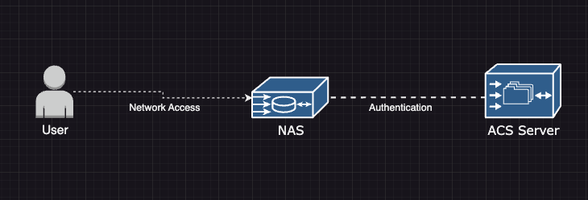

# Navigating RADIUS Authentication: Centralized Security in Networking

RADIUS (Remote Authentication Dial-In User Service) plays a crucial role in the modern network security landscape. This blog post aims to demystify RADIUS authentication, explaining its components and benefits, particularly focusing on the AAA (Authentication, Authorization, and Accounting) framework.

 

## Explaining the AAA Framework

The AAA framework in network security can be understood through simple analogies:

1. **Authentication**: Like showing an ID at a restaurant to prove age for an adult beverage, authentication verifies a user's identity.
2. **Authorization**: Similar to a bouncer removing someone underage from a bar, authorization determines what an authenticated user is allowed to access.
3. **Accounting**: Like a hostess helping track customer traffic during a shift, accounting keeps records of user activities.

 

### The Role of NAS in AAA Implementation

In AAA implementation, the Network Access Server (NAS) acts as an intermediary between the user and the authentication server. It's like a receptionist who checks your ID (authentication) and decides what rooms you can enter (authorization).

 

### Implementing RADIUS Authentication

RADIUS is a networking protocol that centralizes authentication and authorization. It stands for Remote Authentication Dial-In User Service and is used for:

- **Centralized Management**: Streamlines authentication and authorization processes across the network.
- **Scalability**: Easily adapts to growing network demands.
- **Integration**: Works seamlessly with various AAA services.

 

### Benefits of Using RADIUS

1. **Centralized Control**: Manages authentication and authorization from a single point.
2. **Integration with AAA Services**: Consolidates multiple functions, enhancing security and efficiency.
3. **Scalability**: Supports the growth and expansion of network infrastructure.

 

### RADIUS Encryption Algorithms

RADIUS uses several encryption algorithms to secure data, including:

- **CHAP (Challenge-Handshake Authentication Protocol)**
- **TLS (Transport Layer Security)**
- **PEAP (Protected Extensible Authentication Protocol)**

 

### Learning from Videos

For a broader understanding of authentication methods and security protocols, consider watching these informative videos:

- **Authentication Methods**: Explores various techniques used for verifying user identities.
- **Defense in Depth**: Discusses strategies for layering security measures.
- **RADIUS and TACACS**: Covers the specifics of RADIUS and TACACS in network security.
- **Kerberos**: An overview of the Kerberos authentication protocol.

 

### Further Exploration

What aspects of RADIUS authentication or the AAA framework do you find most intriguing, or wish to explore further? How do these concepts apply to your current or future networking projects? Share your thoughts, and let's delve deeper into the world of network security and management.
