# Comprehensive Guide to "Pass the Hash" Attack with Mimikatz

"Pass the Hash" is a crucial technique in the realm of cybersecurity, particularly in the context of exploiting Windows systems. This guide provides a detailed overview of using Mimikatz for "Pass the Hash" attacks, explaining the process step-by-step and offering insights into the challenges and implications of this technique.

 

## Understanding Mimikatz and "Pass the Hash"

 

### Exploring the Basics

- **Mimikatz**: A tool used for extracting authentication credentials like passwords and hash values from Windows systems. It's known for its ability to extract plaintext passwords and hashes from the memory of the lsass.exe process.

- **"Pass the Hash" Technique**: This method involves using a user's hashed password to gain unauthorized access to systems or services. It's akin to bypassing the need for the actual key (password) by using a copy (hash) of it.

 

## Stages of a "Pass the Hash" Attack with Mimikatz

 

### Step-by-Step Breakdown

1. **Environment Setup**: Start by ensuring that you have Mimikatz and other necessary tools. Practice in a controlled environment.

2. **Obtain the Hash**: Extract password hashes from a compromised system. Mimikatz can be used to retrieve these hashes.

3. **Identify Your Target**: Choose the system or service you wish to access using the hash.

4. **Use the Hash for Authentication**: Utilize the hash instead of a plaintext password to authenticate to the target system.

5. **Access Granted (or Denied)**: Successful execution grants access. Failure could be due to various factors like incorrect hashes or security measures.

6. **Post-Exploitation**: Once access is gained, you can perform authorized actions of the compromised account.

 

## Challenges in Executing "Pass the Hash"

 

### Common Difficulties and User Errors

- Executing a "Pass the Hash" attack might seem straightforward, but it involves meticulous attention to detail. Common challenges include typos, confusion between terminal windows, and keeping track of various steps. Patience and careful verification at each step are crucial.

 

## Implications and Concluding Thoughts

 

### The Importance of Awareness and Vigilance

- Learning about tools like Mimikatz underscores the necessity of constant vigilance and updates in system security. It demonstrates the potential vulnerabilities in even well-established systems like Windows and highlights the dual nature of hacking tools - they can be used for both malicious purposes and improving defenses.

 

### Importance of Ethical Practices

- It's crucial to emphasize that such techniques should only be practiced in controlled environments for educational purposes. Unauthorized use of these methods constitutes unethical and illegal behavior.

 

### Areas for Further Inquiry

What aspects of Mimikatz, "Pass the Hash," or related cybersecurity practices do you find most intriguing or wish to explore more deeply? How do these concepts apply to your current or future roles in cybersecurity? Share your thoughts, and let's discuss the complexities and ethical considerations of these powerful cybersecurity tools and techniques.

<!-- # The Ultimate Definitive Incomplete Guide to "Passing the Hash" with MimiKatz

This is the most complete and comprehensive guide to learning about MimiKatz and how to run a “Pass the Hash” attack. Our guide will take you step by step from “beginner” to “amateur” to “I think I understand” in no time at all!

 

## What is MimiKatz?

Mimikatz is a post-exploitation tool that can extract plaintext passwords, hashes, and Kerberos tickets from Windows memory, specifically from the lsass.exe process. It's widely used for both research purposes and by attackers to escalate privileges and move laterally within networks.

 

## How does “pass the hash” work?

The "pass the hash" technique allows attackers to use a user's hashed password, rather than the plaintext version, to authenticate to a remote service or system. This exploits the way certain authentication protocols operate, bypassing the need for the actual password.

"Pass the hash" is like using a photocopy of a key to open a lock, instead of the original key itself. It lets someone pretend to be you without actually knowing your password.

 

## Conditions required for a successful attack

For the "pass the hash" attack to succeed, the attacker needs to first obtain the password hash and the targeted system must accept hashed credentials for authentication without requiring the actual password.

* **Access to the Hash**: The attacker must have already gained access to the hash of a user's password. This is often done by compromising a system and extracting these hashes from it.

* **Target System Vulnerability**: The system or service being targeted must accept authentication using a hash. Not all systems or services do, but many Windows-based systems, for instance, have historically been vulnerable to this kind of attack.

* **Appropriate Privileges**: The hash the attacker has must be of a user account that has the necessary permissions on the target system. For example, if they want to perform administrative tasks, they'd ideally need the hash of an administrator's password.

* **Lack of Monitoring or Defenses**: Systems with security monitoring or certain defenses in place might detect or prevent a "pass the hash" attack. So, the target ideally would lack these protections or the attacker must bypass them.

 

## Pass the Hash Attack Step-by-step

Below is a step by step guide to get started as well as some linked resources and tutorials:
CQURETutorial  Seattle-Ops-401d8: Lab42

### Environment Setup

* Ensure you have the necessary tools. Mimikatz is commonly used for this.
* Set up a controlled lab environment if you're practicing. Never test on unauthorized systems!

<!--  -->
<!-- 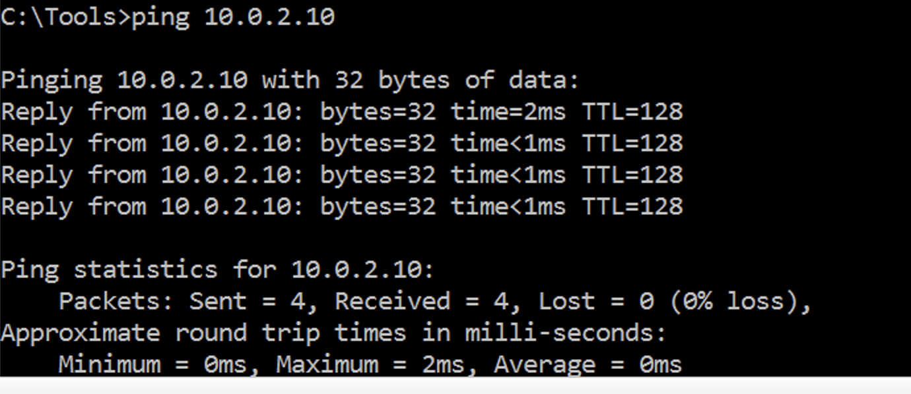 -->
<!--  -->

<!-- 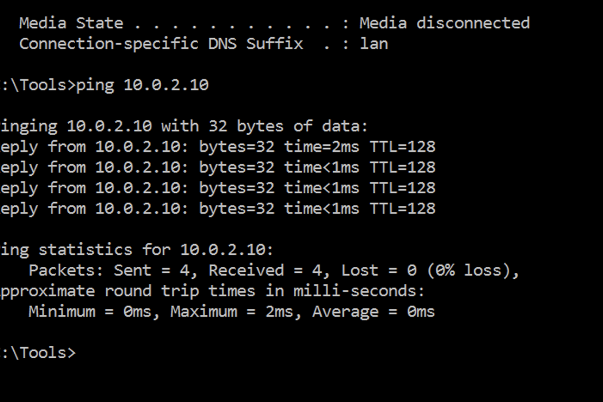 -->
<!--  -->

<!-- ### Obtain the Hash -->

<!-- * This is often the starting point for a "pass the hash" attack. Using tools or methods, you'll need to extract the password hashes from a compromised system. -->

  <!-- * For instance, if you're using Mimikatz, commands like `sekurlsa::logonPasswords` can help retrieve these hashes. -->

<!-- * Here we use `CQHashDumbv2.exe /samdump` from our Tools directory where we have this script available to us in this virtual machine: -->

<!-- 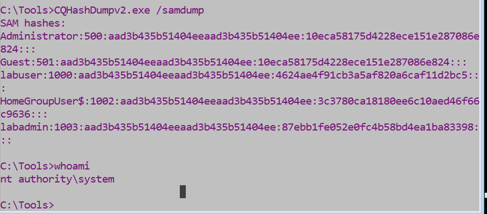 -->
<!--  -->

<!-- ### Identify Your Target -->

<!-- * Decide which machine or service you wish to authenticate against using the hash. This could be a remote system or a service on the same machine. -->

<!-- * For this tutorial we have our “target2” virtual machine with an IP of 10.0.2.10. -->

<!-- 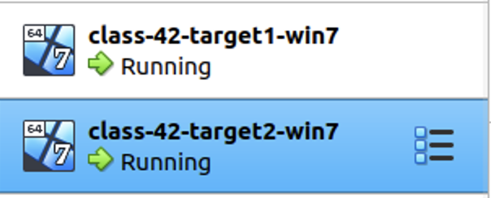 -->
<!--  -->

<!-- ### Use the Hash for Authentication -->

<!-- * Instead of providing a plaintext password, you'll provide the hash to the target system. -->

  <!-- * In the case of Mimikatz, the `sekurlsa::pth` command can be used to "pass the hash" and initiate a session. -->

   <!-- Example:  sekurlsa::pth /user:Administrator /domain:target_domain /ntlm:[NTLM_HASH] -->

<!-- 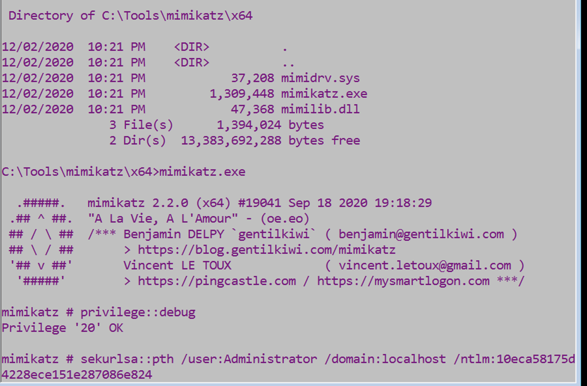 -->
<!--  -->

<!-- 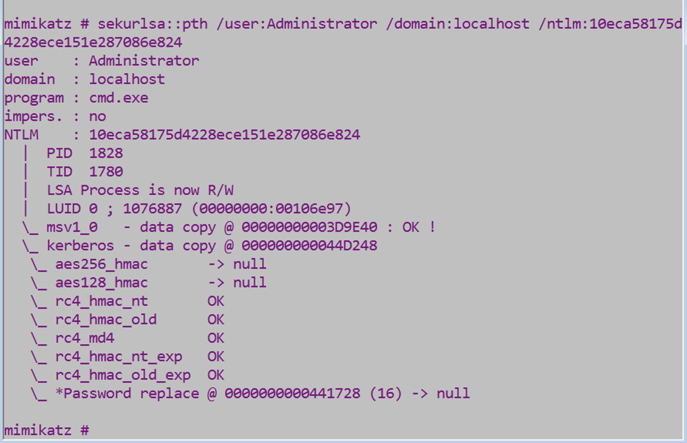 -->
<!--  -->

<!-- 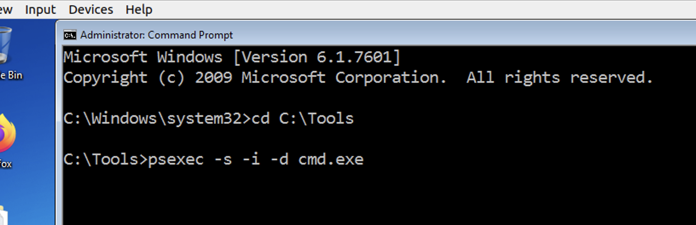 -->
<!--  -->

<!-- ### Access Granted (or Denied)

* If successful, you'll have access to the target with the privileges of the user whose hash you've used.

* If not, it could be due to various reasons, like incorrect hash, insufficient permissions, or security mechanisms blocking the attempt. -->

<!-- 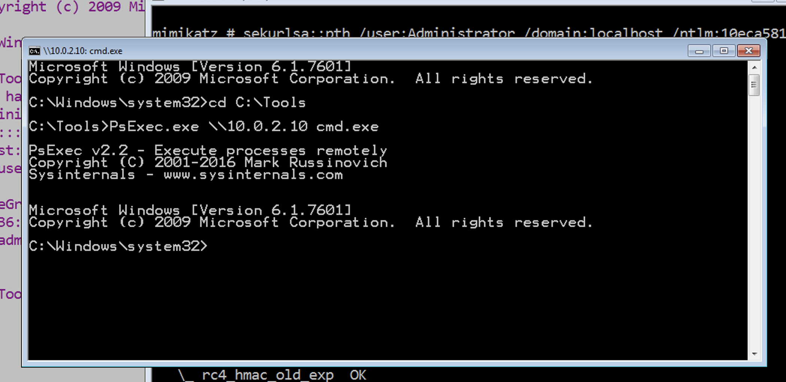 -->
<!--  -->

<!-- ### Post-Exploitation

* Once you have access, you can perform actions that the user account is permitted to do. This might mean accessing files, running commands, or installing software. -->

<!-- 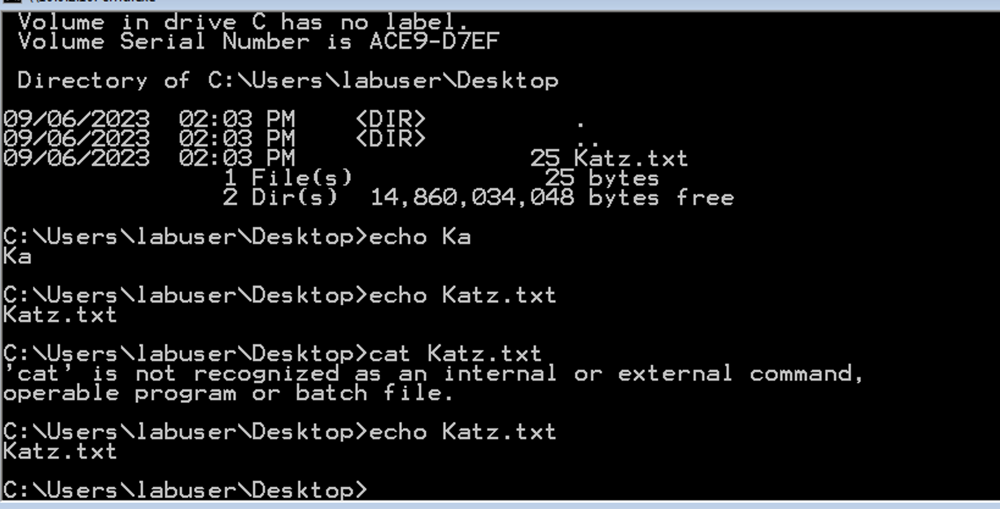 -->
<!--  -->

<!-- 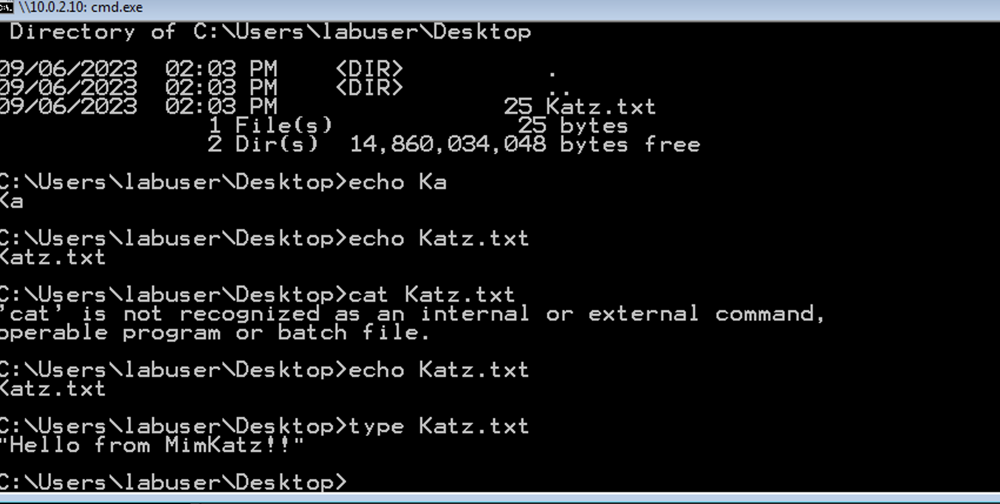 -->
<!--  -->

<!-- 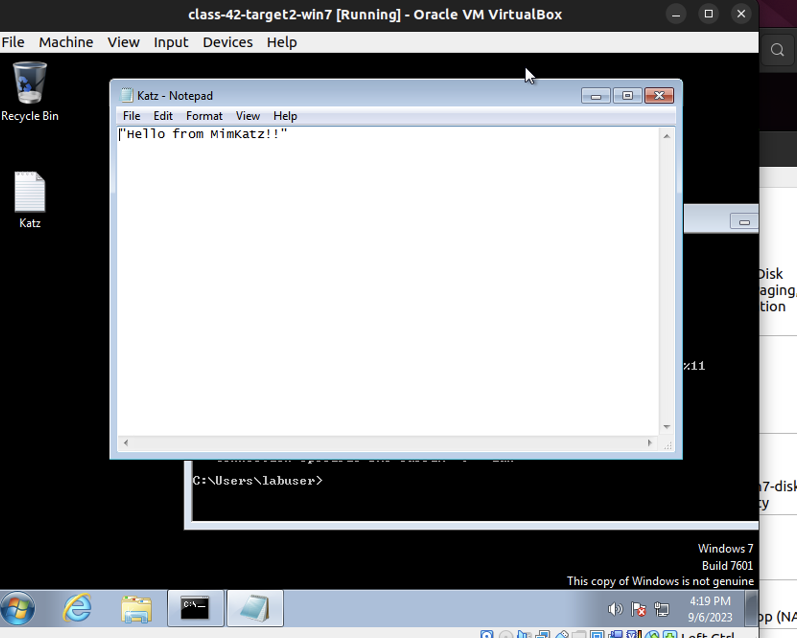 -->
<!--  -->

<!--  

## Challenges faced in learning this attack technique

At a high level, this can seem simple enough, and it can be. There are many small steps that interact together to complete the pass the hash attack. It can be easy to mistype or lose track of what terminal window is working on what task. In the few errors or challenges that appeared, most of them were due to user error. Take your time, go step by step, and confirm before moving onto the next step.

## Concluding thoughts on the “Pass the Hash” attack technique

After diving into Mimikatz, it's clear that even popular systems like Windows have weak spots. Mimikatz highlights why we need to keep updating and watching our systems closely. It also shows that knowing about hacking tools can help us better protect our computers and networks. Lastly, even password protections have their vulnerabilities. --> -->
