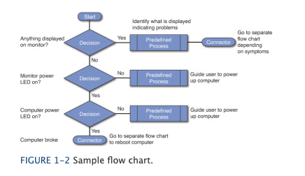

# The Vital Role of Help Desk Support in IT: Skills, Responsibilities, and Processes

In the complex and ever-evolving world of IT, the help desk plays a critical role in customer satisfaction and issue resolution. This blog post delves into the responsibilities of help desk professionals, the essential skills they require, and the typical processes they follow, as represented by a flow chart of a technician's workflow.

 

## The Help Desk Professional: The IT Ambassado

Help desk professionals often represent the first point of contact between the IT department and customers. Their interactions can significantly influence customers' perceptions of the entire organization. These professionals not only resolve technical issues but also shape the organization's image through their service.

 

### First Line of IT Support

As the first line of defense, help desk technicians are responsible for initial documentation, troubleshooting, and detailed recording of issues. They serve as the bridge between users and higher levels of technical support, ensuring that problems are accurately identified and efficiently resolved.

 

### The Balance of Soft and Hard Skills

A proficient help desk professional must possess a blend of both soft and hard skills:

 
 

#### Soft Skills

- **Communication Skills**: Effective interaction with users to understand and explain solutions.
- **Personal Skills**: Patience and empathy towards users' frustrations or lack of technical knowledge.
- **Writing Skills**: Clear documentation of issues and solutions.
- **Training Skills**: Educating users on system functionalities and preventive measures.
- **Critical Thinking**: Actively engaging with the problem, asking probing questions, changing perspectives, and evaluating evidence.

 

#### Hard Skills

- **Technical Skills**: Proficiency in relevant software and hardware.
- **Security Skills**: Understanding of cybersecurity principles.
- **Troubleshooting Skills**: Systematic approach to identifying and solving technical problems.
- **Business Skills**: Awareness of the organization's objectives and the role of IT in achieving them.

 

### A Glimpse into the Technician's Workflow: The Flow Chart

An example flow chart illustrates a typical process a technician might follow when addressing IT issues. This flow chart serves as a roadmap, guiding technicians through various stages of problem identification, analysis, and resolution.

<!--  -->

This flow chart is a visual representation of the structured approach to problem-solving in IT support, highlighting the methodical nature of troubleshooting and issue resolution.

 

## Continuous Learning and Exploration

As technologies evolve, so do the challenges faced by help desk professionals. What areas of IT support or specific skills are you keen to learn more about? Share your interests, and let's continue to explore the dynamic field of IT support together.

