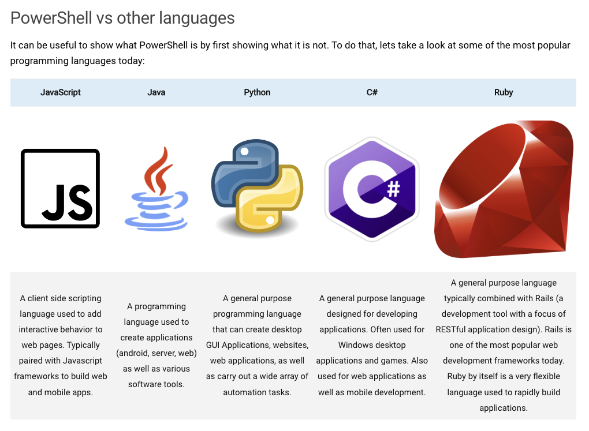

# PowerShell: The Command-Line Powerhouse for Modern System Administration

PowerShell, Microsoft's robust command-line shell and scripting language, has become an indispensable tool for system administrators and power users alike. This blog post aims to explore what PowerShell is, its capabilities, and why learning it can be a game-changer in managing and automating administrative tasks in Windows environments.

 

## Understanding PowerShell

PowerShell is more than just a simple command-line interface; it's a comprehensive scripting environment built on the [.NET framework](https://dotnet.microsoft.com/en-us/learn/dotnet/what-is-dotnet). It blends the capabilities of a command-line shell with a powerful scripting language, enabling efficient system management and automation.

 

### Key Features of PowerShell

- **Command-Line Interface**: Offers an advanced interface for executing system commands.
- **Scripting Language**: Allows writing complex scripts to automate administrative tasks.
- **Built on .NET**: Ensures compatibility and integration with a wide range of Microsoft products and services.
- **Task Automation**: Streamlines the process of configuring and managing systems.

 

## The Role of PowerShell in System Administration

PowerShell is not just for executing commands; it's a versatile tool for a range of administrative tasks:

- **Automating Routine Tasks**: Automate repetitive tasks, making system management more efficient.
- **Configuration Management**: Configure and manage multiple systems or networks from a single interface.
- **System Monitoring**: Monitor system performance and generate reports.
- **Troubleshooting**: Quickly diagnose and resolve system issues.

 

## PowerShell vs. Other Scripting Languages

The accompanying image highlights the differences and unique advantages of PowerShell compared to other scripting languages. It emphasizes PowerShell's focus on managing technology environments, particularly in the context of server and cloud technologies.

<!--  -->

 

## Learning PowerShell: A Valuable Skill

Given its extensive capabilities, learning PowerShell is highly beneficial for anyone involved in Windows system administration. It opens doors to more efficient and effective management of technology environments.

 

## Further Exploration

As PowerShell continues to evolve, what specific aspects of this tool or scripting techniques are you keen to explore further? Share your interests, and let's continue to delve into the powerful world of PowerShell scripting and system administration.
