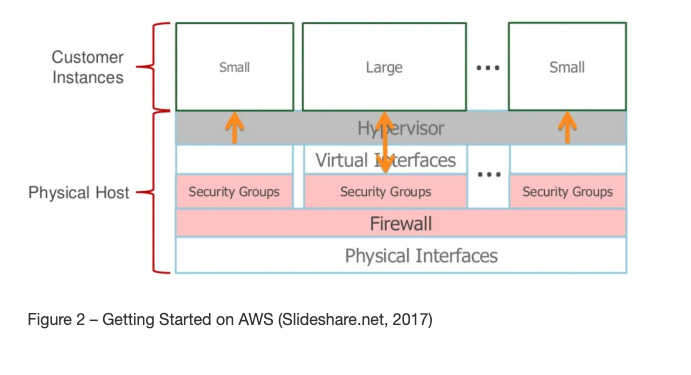
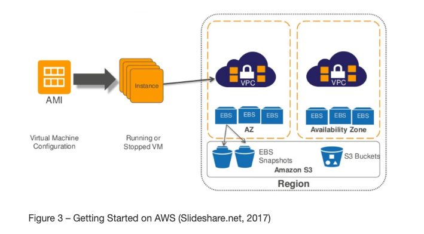
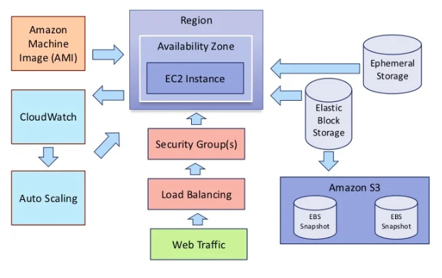

# Revolutionizing IT Infrastructure: An Insight into Cloud Virtualization with AWS

The advent of cloud virtualization, particularly through platforms like Amazon Web Services (AWS), has fundamentally transformed the IT landscape. This blog post aims to provide an in-depth understanding of cloud virtualization in AWS, focusing on Amazon EC2 and its components, and how they collectively redefine computing infrastructure.

 

## Understanding Cloud Virtualization in AWS

Cloud virtualization in AWS primarily revolves around the Amazon Elastic Compute Cloud (EC2), a core component that offers scalable computing power in the AWS cloud.

 

### Virtualization and Amazon EC2

- **Virtualization**: The process of creating virtual versions of physical components. In AWS, this translates to virtual machines running on physical servers.
- **Amazon EC2**: At the heart of AWS's IaaS (Infrastructure as a Service) model, EC2 provides resizable compute capacity, allowing users to launch virtual servers as needed.

 

## The Role of Hypervisors in AWS EC2

A hypervisor is a crucial element in EC2’s virtualization architecture. It acts as a Virtual Machine Manager, sitting atop the host system, and manages customer virtual machines. This setup ensures efficient allocation and management of resources across multiple virtual machines.

 

## Amazon Machine Image (AMI) and Virtual Machine Creation

Another critical aspect of EC2 is the Amazon Machine Image (AMI), a virtual appliance used for creating on-demand virtual machines. AMIs play a pivotal role in the EC2 instance creation process, illustrating the flexibility and scalability of AWS's virtualization approach.

 

## High-Level Architecture of Amazon EC2

The architecture of Amazon EC2 illustrates how EC2 instances are distributed across availability zones and regions. It shows the relationship between instances, storage options (like Ephemeral and Elastic Block Storage), and other AWS services such as Amazon S3 and CloudWatch.

 

## Learning with AWS Cloud Practitioner Essentials

To delve deeper into AWS's core services, including EC2, the AWS Cloud Practitioner Essentials course is an excellent resource. Focusing on the EC2 video provides specific insights into how EC2 operates within the AWS ecosystem.

 

## Further Exploration

As cloud virtualization continues to evolve, what aspects of AWS or cloud computing are you most interested in exploring? How do you envision leveraging AWS's capabilities in your own IT infrastructure? Share your thoughts, and let's discuss the future of cloud computing and its impact on IT infrastructure.
